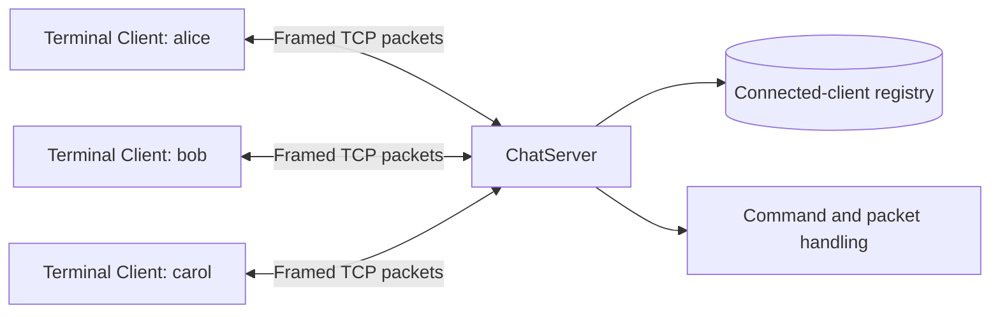

# CPPChat

[](https://github.com/Dumr3n/CPPChat/actions/workflows/windows-ci.yml)


A terminal-based, multi-client TCP chat for Windows, written in modern C++.


## Features

- Length-prefixed binary protocol that handles TCP fragmentation and coalescing
- RAII-managed Winsock sessions and sockets
- Thread-safe broadcasts and graceful Ctrl+C shutdown
- Username validation, duplicate-name detection, timestamps, and join/leave messages
- `/help`, `/users`, `/nick <name>`, `/me <action>`, and `/quit` commands
- Configurable bind address, server address, port, and username

## Architecture

CPPChat uses a client-server architecture. Every client owns one TCP connection
to the server; clients never communicate directly with one another. The server
validates incoming packets, updates shared client state, and broadcasts messages
to the appropriate connections.



The source is divided by responsibility:

```text
CPPChat/
|-- client/              Terminal input, output, and server connection
|-- server/              Connection management, commands, and broadcasts
|-- common/              Shared socket ownership and wire protocol
|-- tests/               GoogleTest protocol tests using loopback TCP
|-- CMakeLists.txt        Targets, dependencies, and test registration
`-- CMakePresets.json     Debug, Release, and test presets
```

### Connection lifecycle

1. The server creates a listening socket and accepts a TCP connection.
2. The client sends a `hello` packet containing its requested username.
3. The server validates the username and rejects invalid or duplicate names.
4. A dedicated `std::jthread` receives packets for that client.
5. Chat packets are broadcast; command packets are handled by the server.
6. On disconnect, the client is removed and the remaining users receive a
   system message.

The connected-client registry is protected by a mutex. Each client also has a
send mutex so packets written by different server threads cannot overlap. The
server copies a snapshot of the recipient list before broadcasting, avoiding a
potentially blocking `send()` while the registry is locked. Sockets and Winsock
initialization use RAII so resources are released automatically.

## Build

Requires CMake 3.20+, a C++20 compiler, and Windows/Winsock.

```powershell
cmake --preset debug
cmake --build --preset debug
```

For an optimized build, replace `debug` with `release`. CMake files are stored
under `build/debug` or `build/release`.

The first configure downloads the pinned GoogleTest dependency. Run the tests with:

```powershell
ctest --preset debug
```

GitHub Actions runs the Debug and Release test suites on `windows-latest` for
every push and pull request targeting `main`. The badge at the top reflects the
latest `main` workflow result.

## Run

Start the server:

```powershell
.\build\debug\Debug\server.exe
```

Then start two or more clients:

```powershell
.\build\debug\Debug\client.exe --name alice
.\build\debug\Debug\client.exe --name bob
```

Use `--help` to see command-line options. The default endpoint is
`127.0.0.1:54000`. To allow LAN connections, explicitly bind the server to an
appropriate local interface and permit the chosen port through Windows Firewall.

## Protocol

TCP provides an ordered byte stream but does not preserve application message
boundaries. CPPChat therefore wraps every message in a length-prefixed packet.

```text
 0               1               5                         5 + N
 +---------------+---------------+-----------------------------+
 | Type (1 byte) | Length (4 B)  | Payload (N bytes)           |
 +---------------+---------------+-----------------------------+
                 | big-endian    | maximum 4096 bytes          |
```

| Field | Size | Description |
|---|---:|---|
| Type | 1 byte | Identifies how the payload should be interpreted |
| Length | 4 bytes | Unsigned payload length in network byte order |
| Payload | 0-4096 bytes | Text encoded as UTF-8 by convention |

Packet types are shared by the client and server:

| Value | Type | Direction | Purpose |
|---:|---|---|---|
| `1` | `hello` | Client to server | Requests a username after connecting |
| `2` | `chat` | Client to server, server to clients | Carries a chat message |
| `3` | `command` | Client to server | Carries commands such as `/users` |
| `4` | `system` | Server to clients | Join, leave, welcome, and action messages |
| `5` | `users` | Server to client | Contains the current online-user list |
| `6` | `error` | Server to client | Reports validation or protocol errors |

`sendPacket()` writes the complete header and payload even if Winsock accepts
only part of the data at a time. `receivePacket()` first reads exactly the
five-byte header, validates the type and length, and then reads exactly the
declared payload size. If multiple packets are already buffered, bytes belonging
to the next packet remain in the socket buffer for the next call. If a packet is
fragmented across several TCP segments, the receive loop reassembles it.

Payloads larger than 4096 bytes and unknown message types are rejected. Empty
payloads are valid at the protocol level, although individual message types may
apply stricter validation.

### Security limitations

The protocol currently has no encryption, authentication, message integrity, or
UTF-8 validation. It is intended for learning and trusted local networks; do not
expose the server directly to the public internet.
